# SCoPE (Support Compression-based Prediction Engine)

**Author:** Jesus Alan Hernadez Galvan

SCoPE is a Python-based tool and library designed for data classification using dissimilarity metrics (such as NCD and CDM) computed via text or sequence compression algorithms (e.g., gzip, zlib, bz2). **It is a training-free model**: instead of relying on a traditional training phase, SCoPE leverages information theory concepts to predict the class of a query by evaluating how "compressible" it is alongside different support samples.

## 🧠 How does the prediction work?

The prediction process in SCoPE revolves around the **SCoPEDistances** architecture. It starts by generating a **Dissimilarity Matrix** combining support samples and the query using dissimilarity metrics based on multiple compression algorithms (e.g., gzip, zlib, bz2). 

Once the matrix is computed, SCoPEDistances uses distance metrics (such as Euclidean distance) and similarity metrics (such as Cosine similarity) to create an ensemble voting system based on the individual decisions of each compressor and metric combination.

Below is a flowchart summarizing the internal prediction pipeline:

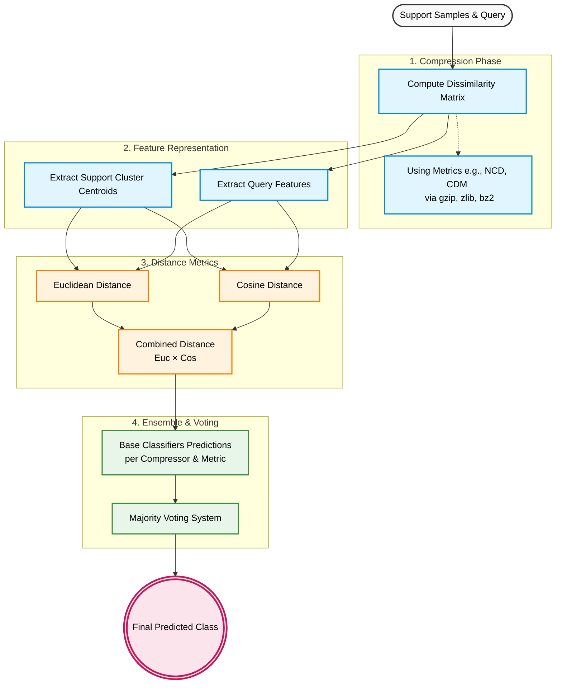

### Dissimilarity Matrix
For each candidate class, SCoPE combines the query sample with the class support set and evaluates all pairwise relationships using a collection of compressors and distance metrics. The resulting pairwise scores are organized into a structured dissimilarity matrix, where each entry represents the dissimilarity between two samples under a specific compressor-metric combination.

This matrix serves as a compact representation of the relational structure between the query and the support examples, capturing both intra-class consistency and query-to-support similarity patterns.

.png)

### Prediction Model
The prediction stage operates on the dissimilarity matrices generated for every candidate class. For each class, SCoPE computes multiple distance functions between the query and supports, producing a collection of distance scores.

The minimum score obtained for each feature across all classes is used as a vote. These votes are then aggregated, and the class receiving the highest number of votes is selected as the final prediction. This voting-based strategy allows SCoPE to leverage diverse compressor-distance combinations while remaining robust to noisy or less informative features.
.png)

*(Note: Spatial evaluation approaches using Convex Hulls, such as `SCoPEPoligon`, are currently planned for future work).*

## 📊 Experimental Results

SCoPE has been evaluated on various molecular datasets such as ClinTox, BACE, and BBBP. For these evaluations, **70% of the data was used for testing/evaluation**, while the remaining **30% was used for parameter search** (experimenting with various numbers of samples for the support set). The following visualizations demonstrate the model's behavior and performance during experiments on the **ClinTox** dataset:

### Dissimilarity Matrix
Visual representation of the pairwise dissimilarities computed between support samples and a query across different compression methods.

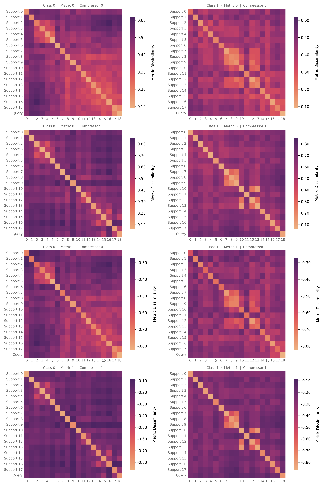

### Normalized Confusion Matrix
Evaluation of the overall predictive performance and class balance on the test data:

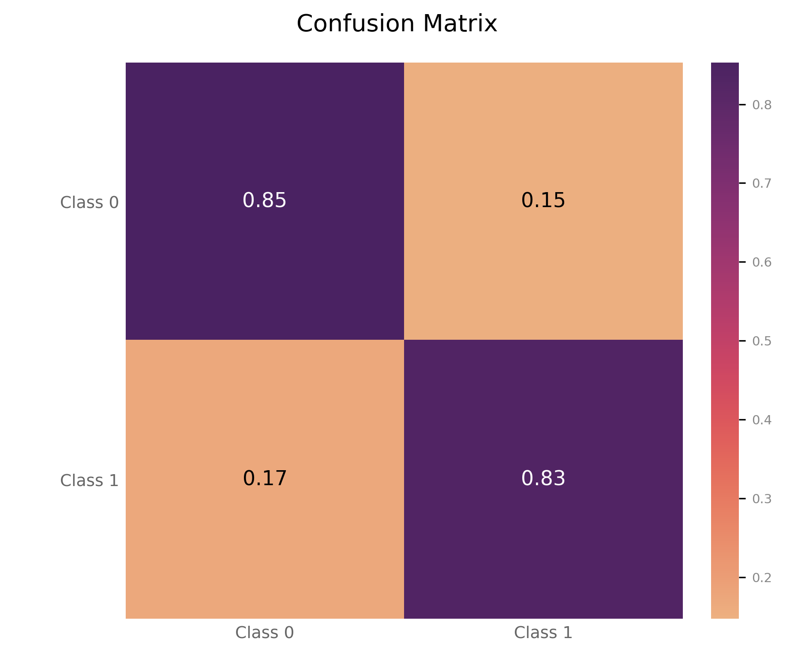

### AUC-ROC Curve
Performance measurement for the classification model at various threshold settings, illustrating its diagnostic ability:

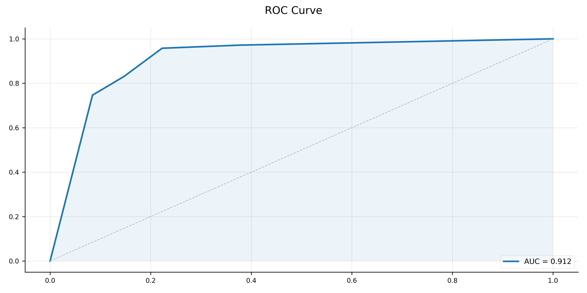

### Voting Analysis (SCoPEDistances)
Shows how different underlying classifiers (based on different combinations of distance metrics and compressors) contribute and vote towards the final class decision:

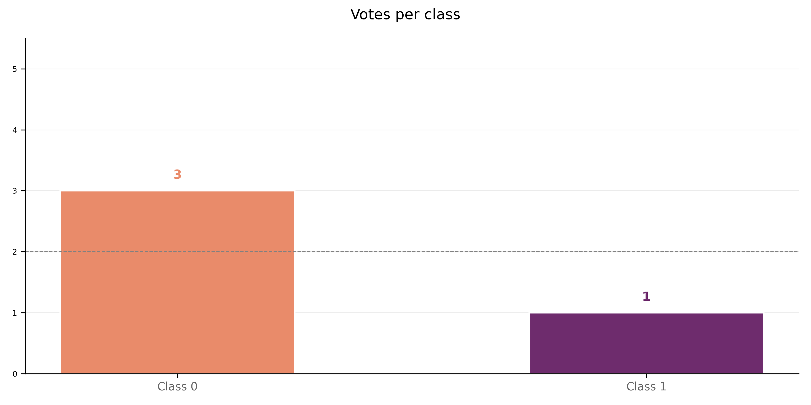

### Multidimensional Breakdown (Spider Plot)
Representation of the multidimensional dissimilarity space of the query with respect to each evaluated class:

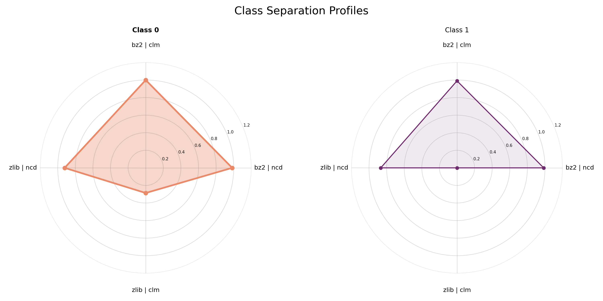

### Parameter Search Validation: Learning Curve
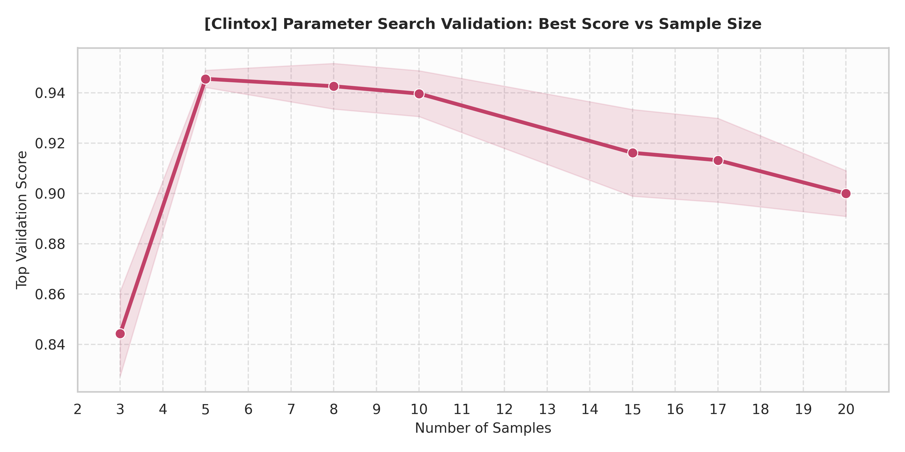

### Ablation Study: Impact of 'keep_similar'
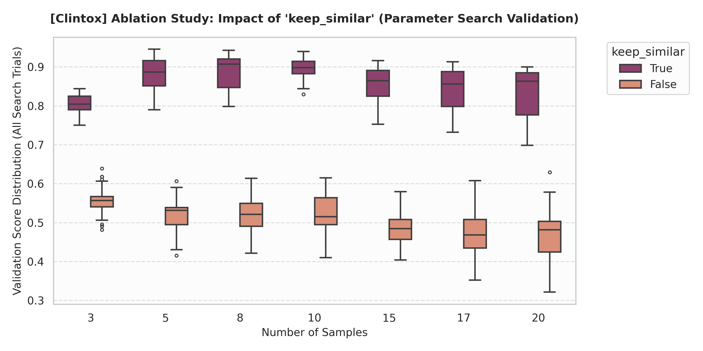

### Optimizer Stability Scatter

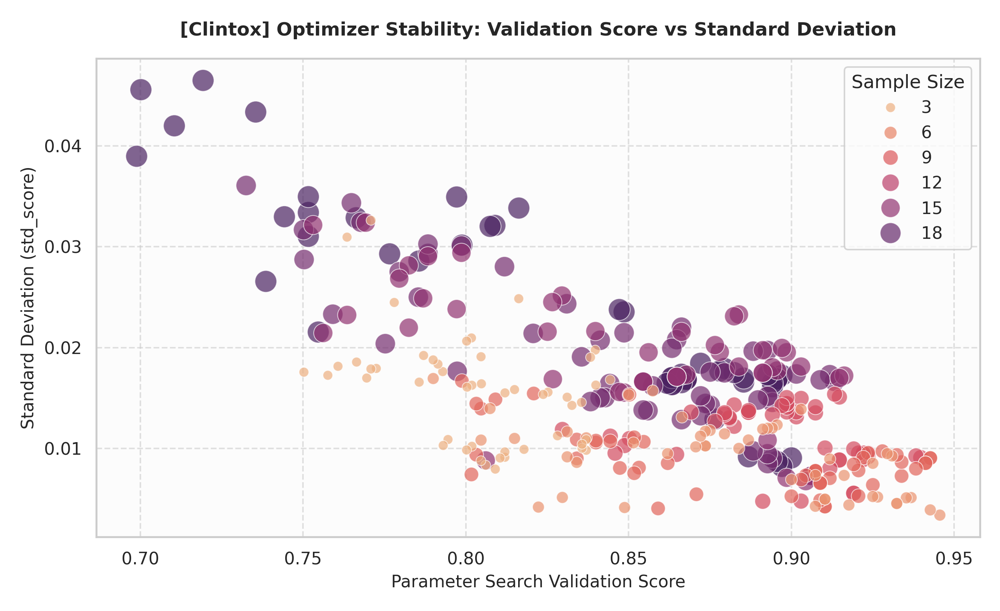

### Synergy Matrix: Compressor vs Metric

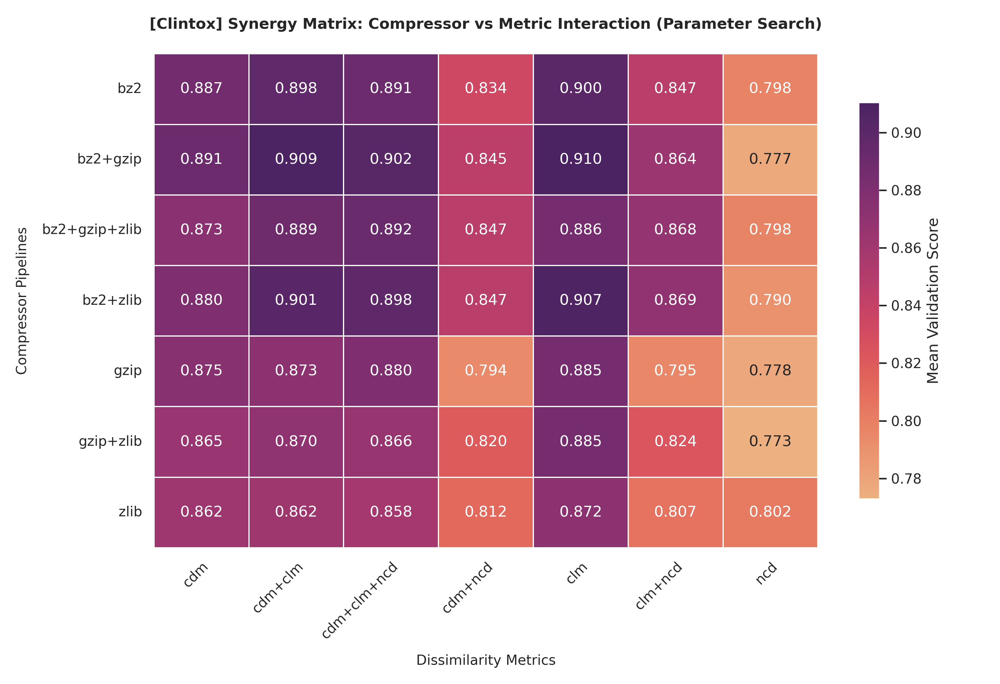

### Final Test Evaluation (Multimetric)

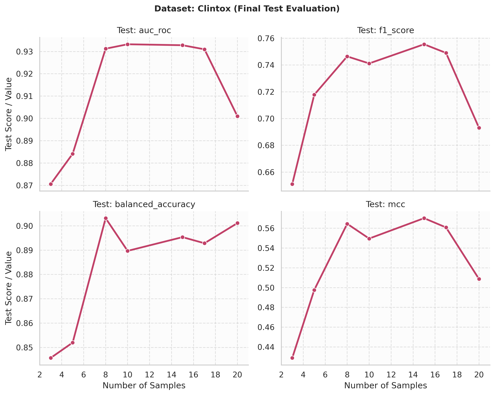

### Test Error Rates Evolution

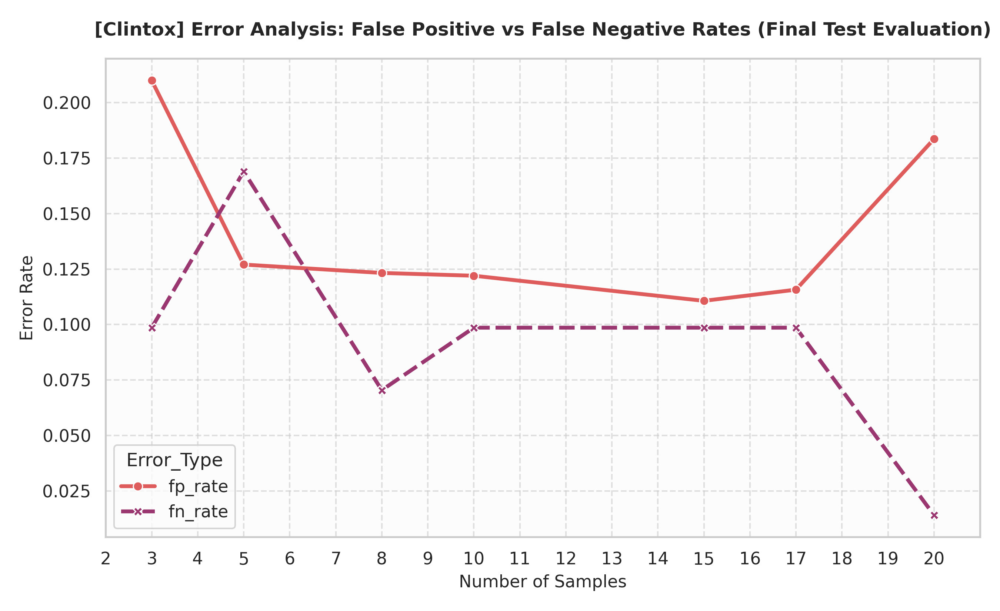

### Generalization Gap: Search vs Test

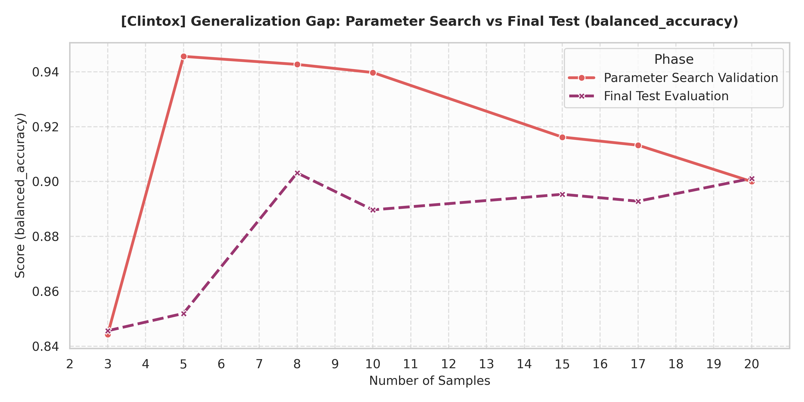

## 🛠️ Project Structure

- `src/scope/`: Main source code, defining the compression matrix logic (`compression`), prediction methods, and SCoPE model classes.
- `experiments/`: Scripts for execution, optimization, and performance analysis on experimental datasets (e.g., bace, bbbp, clintox).
- `assets/`: Visual resources and images for documentation.
