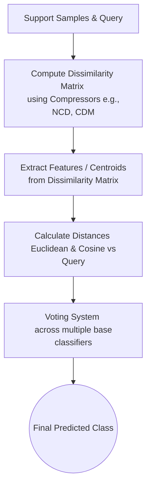

# SCOoPE (Support Compression-based Prediction Engine)

**Author:** Jesus Alan Hernadez Galvan

ScOPE is a Python-based tool and library designed for data classification using dissimilarity matrices based on text or sequence compression algorithms (such as NCD and CDM). Instead of relying on traditional manual vector feature extraction, ScOPE leverages information theory concepts to predict the class of a query by evaluating how "compressible" it is alongside different support samples.

## 🧠 How does the prediction work?

The prediction process in ScOPE revolves around the **SCoPEDistances** architecture. It starts by generating a **Dissimilarity Matrix** combining support samples and the query using multiple compression algorithms. 

Once the matrix is computed, SCoPEDistances uses distance metrics (such as Euclidean distance) and similarity metrics (such as Cosine similarity) to create an ensemble voting system based on the individual decisions of each compressor and metric combination.

Below is a flowchart summarizing the internal prediction pipeline:

*(Note: Spatial evaluation approaches using Convex Hulls, such as `SCoPEPoligon`, are currently planned for future work).*

## 📊 Experimental Results

ScOPE has been evaluated on various molecular datasets such as ClinTox, BACE, and BBBP. The following visualizations demonstrate the model's behavior and performance during experiments on the **ClinTox** dataset:

### Dissimilarity Matrix
Visual representation of the pairwise dissimilarities computed between support samples and a query across different compression methods.

### Normalized Confusion Matrix
Evaluation of the overall predictive performance and class balance on the test data:

### Voting Analysis (SCoPEDistances)
Shows how different underlying classifiers (based on different combinations of distance metrics and compressors) contribute and vote towards the final class decision:

### Multidimensional Breakdown (Spider Plot)
Representation of the multidimensional dissimilarity space of the query with respect to each evaluated class:

## 🛠️ Project Structure

- `src/scope/`: Main source code, defining the compression matrix logic (`compression`), prediction methods, and SCoPE model classes.
- `experiments/`: Scripts for execution, optimization, and performance analysis on experimental datasets (e.g., bace, bbbp, clintox).
- `assets/`: Visual resources and images for documentation.
